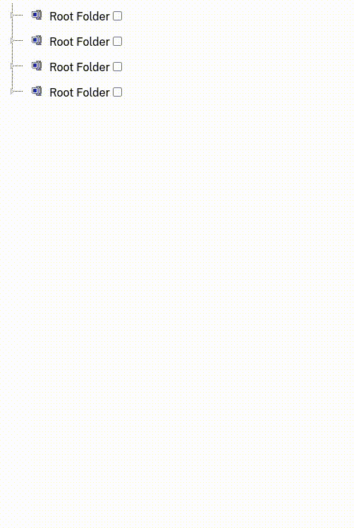

# Vue3 JSTree Component

## Demo



## Usage

Using json file for parsing data

`npm i vue3-jstree-component`  
`<RootTree :treedata="myData" />`

## Data Input Format - json file

```
[
{
  "name": "Root Folder",
  "id": 1,
  "children": [
    {
      "name": "File #1"
    },
    {
      "name": "File #2",
      "children: [
        {
          "name": "Child 1",
          "name": "Child 2"
          }
      ]
    }
]
```
